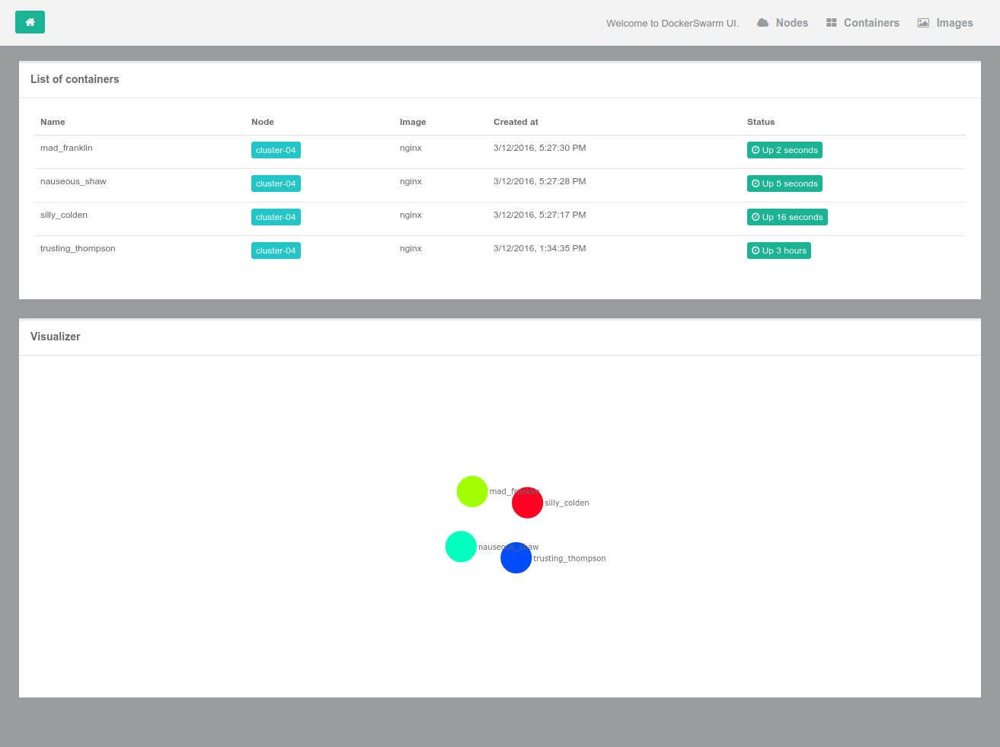
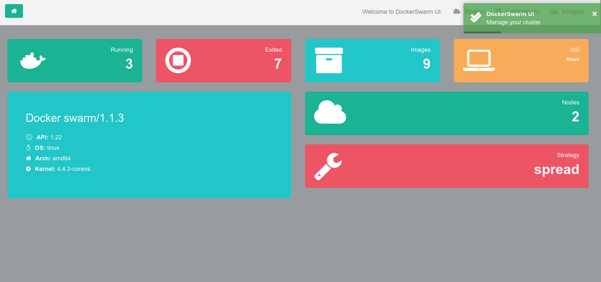

## DockerSwarm UI

DockerSwarm UI gives you the ability to manage Docker resources including containers, images, nodes and much more to come.

DockerSwarm UI is 100% compatible with the Docker Remote API and Docker Swarm API.

## Update

- Fixed issue of DockerSwarm 1.2.2

## Walkthrough

1 - Containers

The containers section provides a single view of all containers in the Swarm cluster. You can see details about the containers such as what image is being used, container status, when it was created and more.



2 - Images

DockerSwarm UI enables you to see what images and tags exist across the cluster.
This enables you to quickly see what versions of what images are deployed to the Swarm nodes.


3 - Nodes

You can see all Swarm nodes and their IP / hostnames from the nodes view.


4 - Version/info

Report information such as Docker API, running/existed containers, Docker swarm strategy type ...



## Quickstart

```sh
$ docker run -d -p 3000:3000 -v /var/run/docker.sock:/var/run/docker.sock --name dockerswarm-ui mlabouardy/dockerswarm-ui
```

Open your browser to http://IP_ADDR:3000

Bind mounting the Unix socket into the DockerUI container is much more secure than exposing your docker daemon over TCP.

## Specify socket to connect to Docker daemon

By default DockerUI connects to the Docker daemon with/var/run/docker.sock. For this to work you need to bind mount the unix socket into the container with -v /var/run/docker.sock:/var/run/docker.sock.

You can use the -e flag to change this socket:

```sh
$ docker run -d -p 3000:3000 -e DOCKER_HOST=tcp://IP:2375 --name dockerswarm-ui mlabouardy/dockerswarm-ui
```

### Connecting to a TLS secured swarm

The following environment variables can be set to connect to a TLS secured swarm manager:
- DOCKER_TLS - set to true to use TLS
- DOCKER_TLS_CERT - path to TLS certificate
- DOCKER_TLS_KEY - path to private key
- DOCKER_TLS_CACERT - path to ca chain certificate

Run dockerswarm-ui as follows, remembering to mount your certificate folder as a volume:
```
docker run -d \ 
-p 3000:3000 \
-v /path/to/certs/:/certs \
-e DOCKER_HOST=tcp://IP:2376 \
-e DOCKER_TLS=true \
-e DOCKER_TLS_CERT=/certs/cert.pem \
-e DOCKER_TLS_KEY=/certs/key.pem \
-e DOCKER_TLS_CACERT=/certs/ca.pem \
--name dockerswarm-ui mlabouardy/dockerswarm-ui
```

## Contributors

Mohamed Labouardy <mohamed@labouardy.com> <br/>
Simon Tweed <simonjtweed@gmail.com>

## Help

If you run into issues, please don't hesitate to find help on the GitHub project.

## License

The DockerSwarm UI project is covered by the MIT License.

The MIT License (MIT)

Copyright (c) 2016 Mohamed Labouardy and contributors to the DockerSwarm UI project.

Permission is hereby granted, free of charge, to any person obtaining a copy of this software and associated documentation files (the "Software"), to deal in the Software without restriction, including without limitation the rights to use, copy, modify, merge, publish, distribute, sublicense, and/or sell copies of the Software, and to permit persons to whom the Software is furnished to do so, subject to the following conditions:

The above copyright notice and this permission notice shall be included in all copies or substantial portions of the Software.

THE SOFTWARE IS PROVIDED "AS IS", WITHOUT WARRANTY OF ANY KIND, EXPRESS OR IMPLIED, INCLUDING BUT NOT LIMITED TO THE WARRANTIES OF MERCHANTABILITY, FITNESS FOR A PARTICULAR PURPOSE AND NONINFRINGEMENT. IN NO EVENT SHALL THE AUTHORS OR COPYRIGHT HOLDERS BE LIABLE FOR ANY CLAIM, DAMAGES OR OTHER LIABILITY, WHETHER IN AN ACTION OF CONTRACT, TORT OR OTHERWISE, ARISING FROM, OUT OF OR IN CONNECTION WITH THE SOFTWARE OR THE USE OR OTHER DEALINGS IN THE SOFTWARE.
