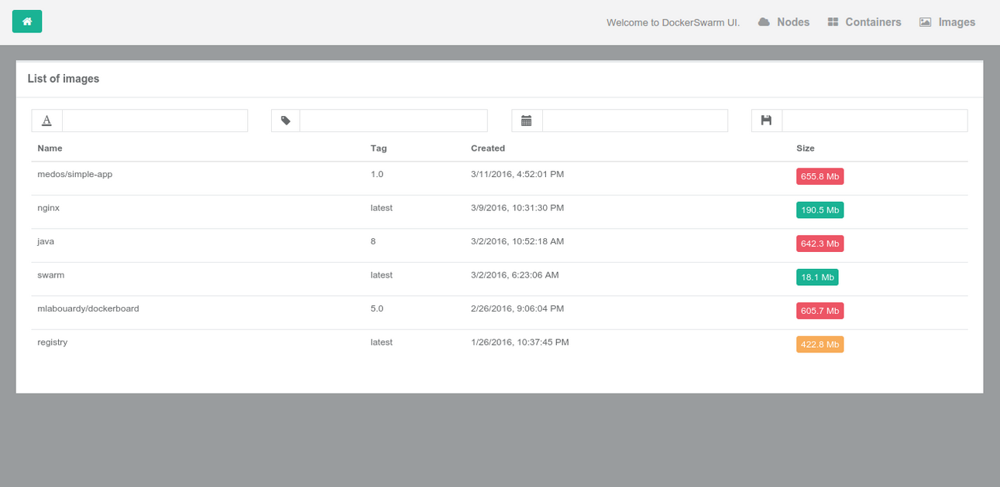
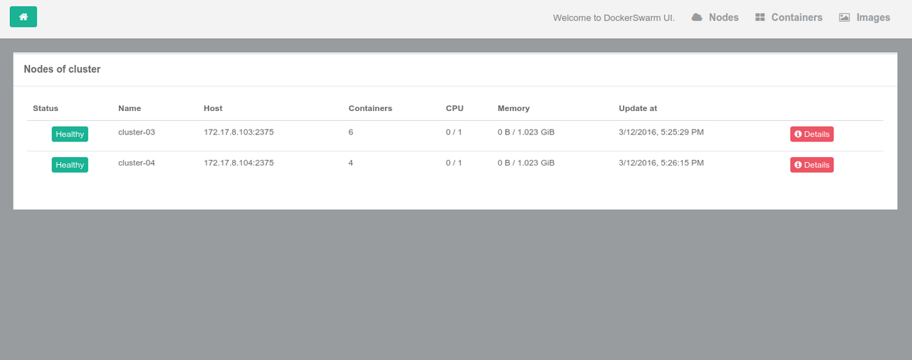

## DockerSwarm UI

DockerSwarm UI gives you the ability to manage Docker resources including containers, images, nodes and much more to come.

DockerSwarm UI is 100% compatible with the Docker Remote API and Docker Swarm API.

## Walkthrough

1 - Containers

The containers section provides a single view of all containers in the Swarm cluster. You can see details about the containers such as what image is being used, container status, when it was created and more.


2 - Images

DockerSwarm UI enables you to see what images and tags exist across the cluster.
This enables you to quickly see what versions of what images are deployed to the Swarm nodes.



3 - Nodes

You can see all Swarm nodes and their IP / hostnames from the nodes view.



4 - Version/info

Report information such as Docker API, running/existed containers, Docker swarm strategy type ...


## Quickstart

```sh
$ docker run -d -p 3000:3000 -v /var/run/docker.sock:/var/run/docker.sock --name dockerswarm-ui mlabouardy/dockerswarm-ui
```

Open your browser to http://<dockerd host ip>:3000

Bind mounting the Unix socket into the DockerUI container is much more secure than exposing your docker daemon over TCP.

## Specify socket to connect to Docker daemon

By default DockerUI connects to the Docker daemon with/var/run/docker.sock. For this to work you need to bind mount the unix socket into the container with -v /var/run/docker.sock:/var/run/docker.sock.

You can use the -e flag to change this socket:

```sh
$ docker run -d -p 3000:3000 -e DOCKER_HOST=tcp://IP:2375 --name dockerswarm-ui mlabouardy/dockerswarm-ui
```
## Contributors

Mohamed Labouardy <mohamed@labouardy.com

## Help

If you run into issues, please don't hesitate to find help on the GitHub project.
